# Resultados

> Documento **gerado** por `python scripts/build_results.py`. Nenhum número aqui foi digitado à mão — todos vêm de `reports/benchmark.csv` e `reports/metrics.json`. Regere sempre que a base mudar.

- **Série:** 548 observações mensais, 01/1972 a 08/2017
- **Backtest:** walk-forward, 36 meses de teste, treino mínimo 240, embargo `True`
- **Horizontes:** [1, 3, 12]
- **Significância:** Diebold-Mariano bilateral, HAC de Bartlett com h−1 defasagens e correção Harvey-Leybourne-Newbold, α = 0.05
- **Gerado em:** 2026-09-01 16:20 UTC
- **Ambiente:** Python 3.14.7 (Windows) · numpy 2.5.2, pandas 3.0.5, scikit-learn 1.9.0, scipy 1.18.1, xgboost 3.4.1, lightgbm 4.7.0
- **Proveniência:** dado bruto `310335f07908`

> Os **vereditos** deste relatório se reproduzem em qualquer ambiente compatível com o `requirements.txt`. Os **dígitos** dos modelos de árvore, não: a implementação muda entre versões de scikit-learn. Modelos lineares e baselines batem exatamente. É por isso que o ambiente está declarado acima.

## Conclusão

Ganho sustentado por evidência em **h=[1]**: nesses horizontes o modelo se justifica.
Sem evidência de ganho em **h=[3, 12]**: o naive sazonal é suficiente, e manter modelo ali é custo sem retorno demonstrado.

Leitura obrigatória do p-valor: não rejeitar a hipótese nula **não** prova equivalência. Com poucas observações o teste tem baixo poder, e a afirmação honesta é *"não há evidência de diferença"*, nunca *"são iguais"*.

## O ganho sobrevive à troca da janela de teste?

Uma janela de teste só responde *quanto o modelo ganhou naqueles meses* — não responde *o modelo ganha*. Repetindo a medição em janelas de tamanhos diferentes, um ganho real se mantém; um ganho que era característica do período oscila e pode trocar de sinal.

**h=1 — `hist_gradient_boosting`:** ESTÁVEL — o ganho se mantém entre +31.9% e +42.3% em todas as janelas

| Janela | Período | Campeão | Naive | Ganho | DM p |
|---|---|---|---|---|---|
| 36 | 2014-09 a 2017-08 | 2.838% | 4.921% | +42.0% | **0.001** |
| 72 | 2011-09 a 2017-08 | 2.886% | 4.961% | +41.6% | **0.000** |
| 144 | 2005-09 a 2017-08 | 3.575% | 6.268% | +42.3% | **0.000** |
| 284 | 1994-01 a 2017-08 | 3.229% | 4.824% | +31.9% | **0.000** |

**h=3 — `hist_gradient_boosting`:** ESTÁVEL — o ganho se mantém entre +3.8% e +13.4% em todas as janelas

| Janela | Período | Campeão | Naive | Ganho | DM p |
|---|---|---|---|---|---|
| 36 | 2014-09 a 2017-08 | 4.195% | 4.921% | +13.4% | 0.444 |
| 72 | 2011-09 a 2017-08 | 4.472% | 4.961% | +8.6% | 0.411 |
| 144 | 2005-09 a 2017-08 | 5.529% | 6.268% | +10.6% | 0.114 |
| 282 | 1994-03 a 2017-08 | 4.592% | 4.852% | +3.8% | 0.479 |

**h=12 — `ridge_fourier`:** NÃO REPRODUZÍVEL — o ganho troca de sinal entre janelas (-29.4% a +10.3%)

| Janela | Período | Campeão | Naive | Ganho | DM p |
|---|---|---|---|---|---|
| 36 | 2014-09 a 2017-08 | 4.388% | 4.921% | +10.3% | 0.476 |
| 72 | 2011-09 a 2017-08 | 4.980% | 4.961% | +0.4% | 0.978 |
| 144 | 2005-09 a 2017-08 | 8.277% | 6.268% | -29.4% | 0.134 |
| 273 | 1994-12 a 2017-08 | 6.014% | 4.969% | -18.4% | 0.155 |

> Em **h=[12]** o ganho troca de sinal conforme o período avaliado. Um modelo cuja vantagem medida é ora positiva ora negativa não é um modelo indeciso — o ganho dele não é reproduzível, e isso basta para não colocá-lo em produção nesse horizonte.

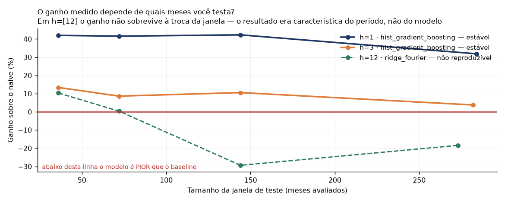

## Quanta confiança a amostra permite

O p-valor diz se há evidência; não diz de que tamanho é o ganho, nem se o experimento conseguiria enxergá-lo. As duas colunas abaixo respondem isso — a primeira por bootstrap de blocos sobre os erros observados, a segunda impondo vantagens conhecidas e contando quantas vezes o teste as encontra.

| h | Ganho vs. naive | Intervalo | Detecta a partir de | Poder no ganho observado | Falso positivo |
|---|---|---|---|---|---|
| 1 | +42.0% | [+27.7%, +53.4%] | 35% | 97% | 6% |
| 3 | +13.4% | [-12.8%, +34.2%] | 40% | 16% | 11% ⚠ |
| 12 | +10.3% | [-8.8%, +18.5%] | 40% | 13% | 27% ⚠ |

- **h=1:** ganho sustentado — o intervalo não contém zero.
- **h=3:** inconclusivo por TAMANHO DE AMOSTRA. O ganho observado (+13.4%) está abaixo do que esta base consegue detectar (40.0%); 'empate' descreve o experimento, não os modelos.
- **h=12:** inconclusivo por TAMANHO DE AMOSTRA. O ganho observado (+10.3%) está abaixo do que esta base consegue detectar (40.0%); 'empate' descreve o experimento, não os modelos.

> ⚠ Em vantagem imposta zero o teste deveria rejeitar 5% das vezes. Em h=[3, 12] ele rejeita mais, porque sobram poucos blocos por reamostragem. O efeito mínimo detectável desses horizontes é grosseiro — e, se algo, otimista.

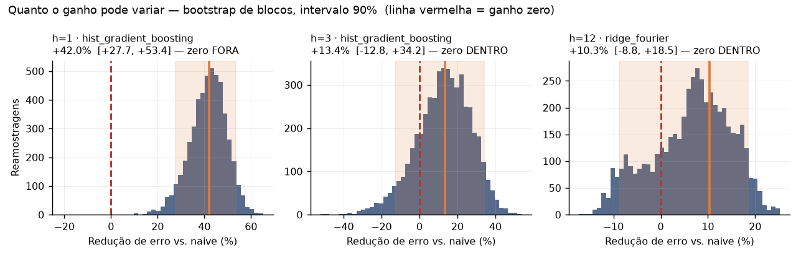

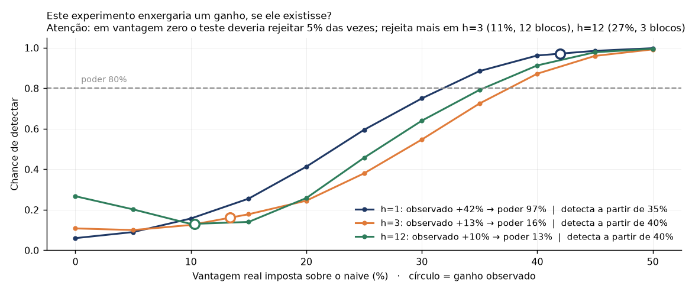

## Horizonte h=1

**Campeão declarado:** `hist_gradient_boosting` — HistGradientBoosting supera o naive sazonal (DM p=0.001) — ganho sustentado por evidência

| Modelo | MAPE | MASE | MAE | Viés | p vs naive | q (BH) |
|---|---|---|---|---|---|---|
| lightgbm | 2.826% | 0.616 | 3.154 | -0.70 | **0.001** | **0.011** |
| **hist_gradient_boosting** | 2.838% | 0.617 | 3.163 | -0.80 | **0.001** | **0.011** |
| gradient_boosting | 2.925% | 0.635 | 3.254 | -0.48 | **0.003** | **0.011** |
| xgboost | 2.994% | 0.653 | 3.344 | -0.82 | **0.002** | **0.011** |
| ridge_fourier | 3.006% | 0.654 | 3.351 | -1.22 | **0.003** | **0.011** |
| random_forest | 3.285% | 0.721 | 3.695 | -1.20 | **0.003** | **0.011** |
| seasonal_naive | 4.921% | 1.064 | 5.452 | -2.38 | — (é o baseline) | — (é o baseline) |
| seasonal_naive_drift | 5.923% | 1.268 | 6.496 | -1.20 | **0.037** | 0.111 |

- Explicação: SHAP: contribuição média absoluta de cada variável (TreeSHAP)
- Peso do eco sazonal (lag_12 + lag_24 + yoy_diff_12): 40.1%
- Viés médio do campeão: -0.80 pontos
- Maior ganho sobre o naive: Ago
- Meses em que o naive ainda vence: Jan
- Previsão: Set/2017 117.0
- Intervalo empírico 80%: -4.36 a +5.32 pontos

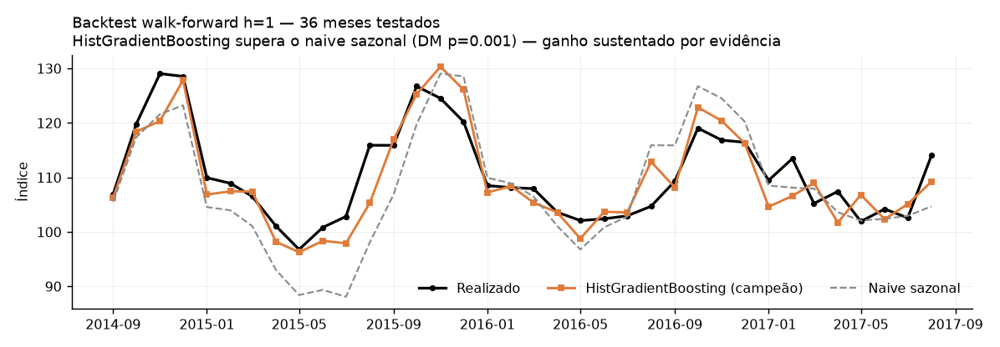

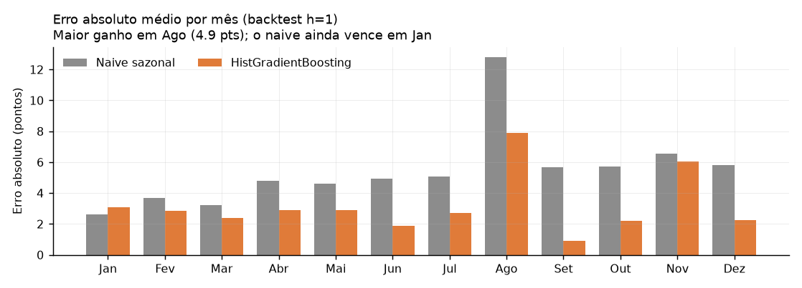

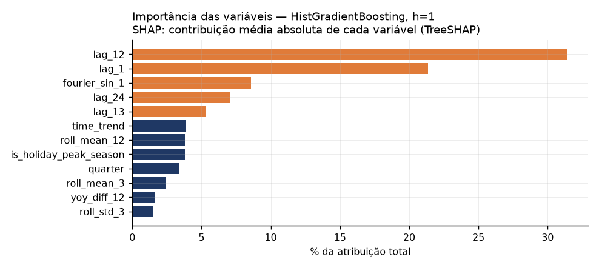

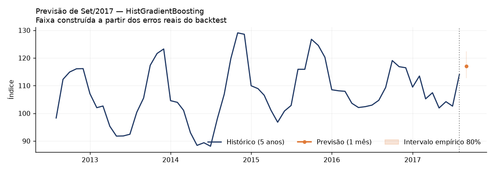

## Horizonte h=3

**Campeão declarado:** `hist_gradient_boosting` — Empate técnico com o naive sazonal (DM p=0.444) — sem evidência de ganho neste horizonte

| Modelo | MAPE | MASE | MAE | Viés | p vs naive | q (BH) |
|---|---|---|---|---|---|---|
| gradient_boosting | 4.112% | 0.901 | 4.618 | -1.38 | 0.306 | 0.429 |
| **hist_gradient_boosting** | 4.195% | 0.922 | 4.723 | -1.51 | 0.444 | 0.526 |
| lightgbm | 4.231% | 0.929 | 4.758 | -1.38 | 0.457 | 0.526 |
| xgboost | 4.241% | 0.929 | 4.759 | -1.85 | 0.368 | 0.483 |
| seasonal_naive | 4.921% | 1.064 | 5.452 | -2.38 | — (é o baseline) | — (é o baseline) |
| random_forest | 4.906% | 1.070 | 5.485 | -2.32 | 0.961 | 0.961 |
| ridge_fourier | 5.169% | 1.126 | 5.771 | -2.10 | 0.791 | 0.830 |
| seasonal_naive_drift | 5.923% | 1.268 | 6.496 | -1.20 | 0.113 | 0.238 |

- Explicação: SHAP: contribuição média absoluta de cada variável (TreeSHAP)
- Peso do eco sazonal (lag_12 + lag_24 + yoy_diff_12): 56.6%
- Viés médio do campeão: -1.51 pontos
- Maior ganho sobre o naive: Jun
- Meses em que o naive ainda vence: Jan, Fev, Nov, Dez
- Previsão: Set/2017 112.9 · Out/2017 118.6 · Nov/2017 118.8
- Intervalo empírico 80%: -6.17 a +8.90 pontos

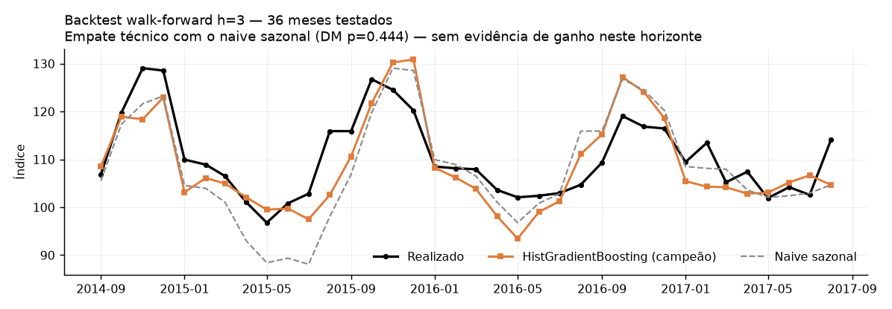

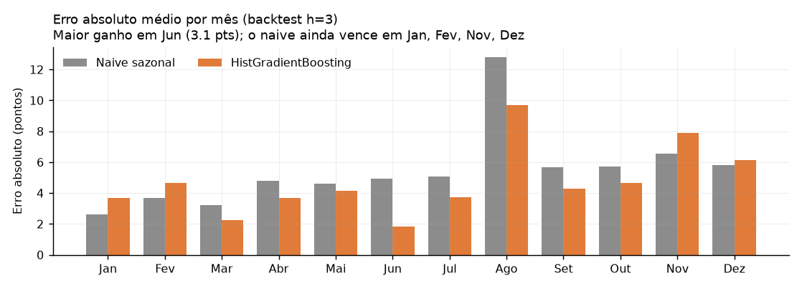

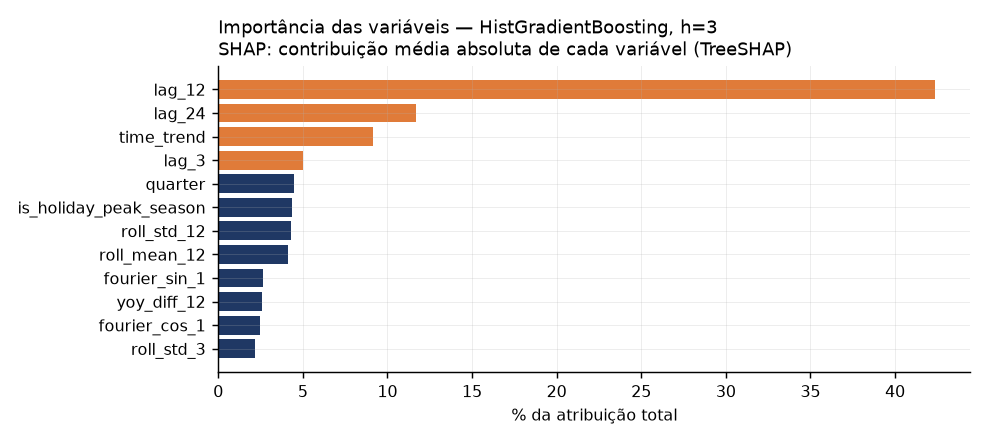

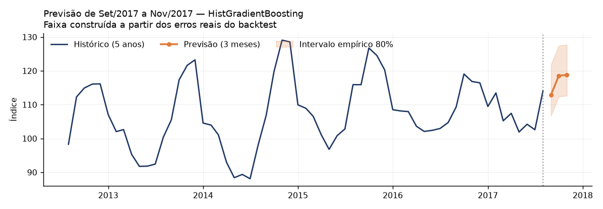

## Horizonte h=12

**Campeão declarado:** `ridge_fourier` — Empate técnico com o naive sazonal (DM p=0.476) — sem evidência de ganho neste horizonte

| Modelo | MAPE | MASE | MAE | Viés | p vs naive | q (BH) |
|---|---|---|---|---|---|---|
| **ridge_fourier** | 4.388% | 0.954 | 4.888 | -1.18 | 0.476 | 0.526 |
| seasonal_naive | 4.921% | 1.064 | 5.452 | -2.38 | — (é o baseline) | — (é o baseline) |
| random_forest | 5.530% | 1.190 | 6.098 | -3.91 | 0.290 | 0.429 |
| seasonal_naive_drift | 5.923% | 1.268 | 6.496 | -1.20 | 0.082 | 0.192 |
| gradient_boosting | 6.126% | 1.333 | 6.830 | -3.19 | 0.279 | 0.429 |
| hist_gradient_boosting | 6.411% | 1.389 | 7.116 | -4.56 | 0.179 | 0.342 |
| xgboost | 6.408% | 1.390 | 7.125 | -3.47 | 0.204 | 0.358 |
| lightgbm | 6.739% | 1.455 | 7.458 | -3.78 | 0.077 | 0.192 |

- Explicação: Magnitude relativa do coeficiente sobre variáveis padronizadas
- Peso do eco sazonal (lag_12 + lag_24 + yoy_diff_12): 64.0%
- Viés médio do campeão: -1.18 pontos
- Maior ganho sobre o naive: Ago
- Meses em que o naive ainda vence: Mar, Nov, Dez
- Previsão: Set/2017 112.0 · Out/2017 122.0 · Nov/2017 120.7 · Dez/2017 119.8 · Jan/2018 110.0 · Fev/2018 111.6 · Mar/2018 105.4 · Abr/2018 107.1 · Mai/2018 102.7 · Jun/2018 104.4 · Jul/2018 103.9 · Ago/2018 112.8
- Intervalo empírico 80%: -8.04 a +7.08 pontos

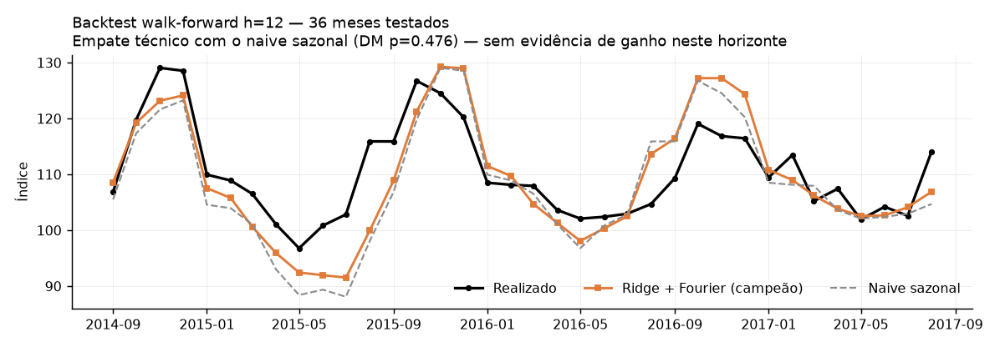

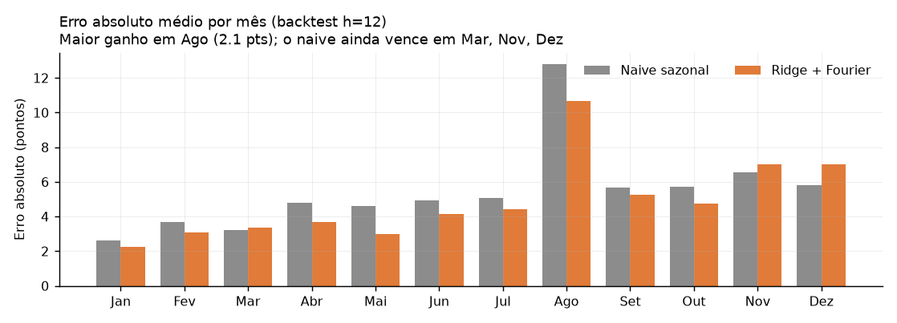

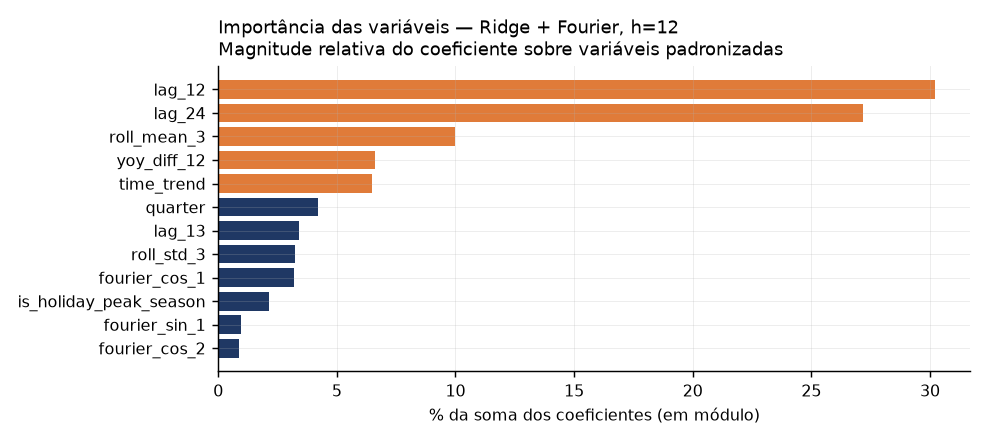

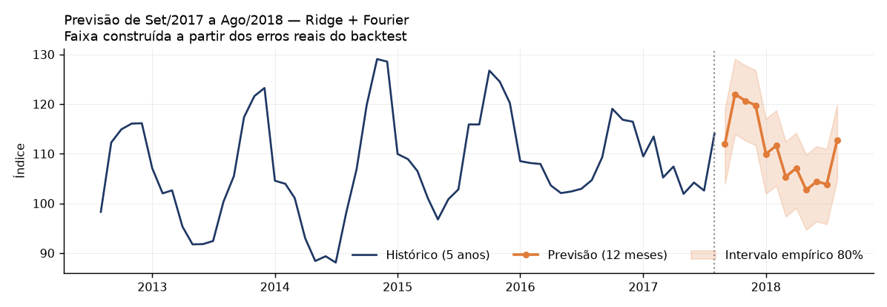

---

Metodologia, decisões de projeto e limitações conhecidas: ver `README.md`. Para reproduzir do zero: `make audit`.
